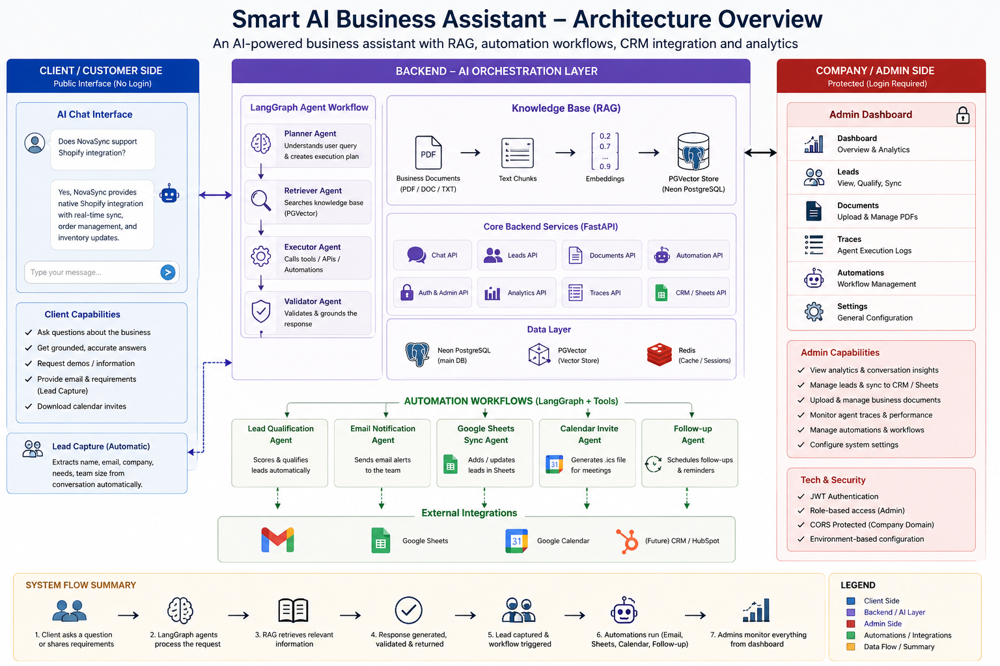
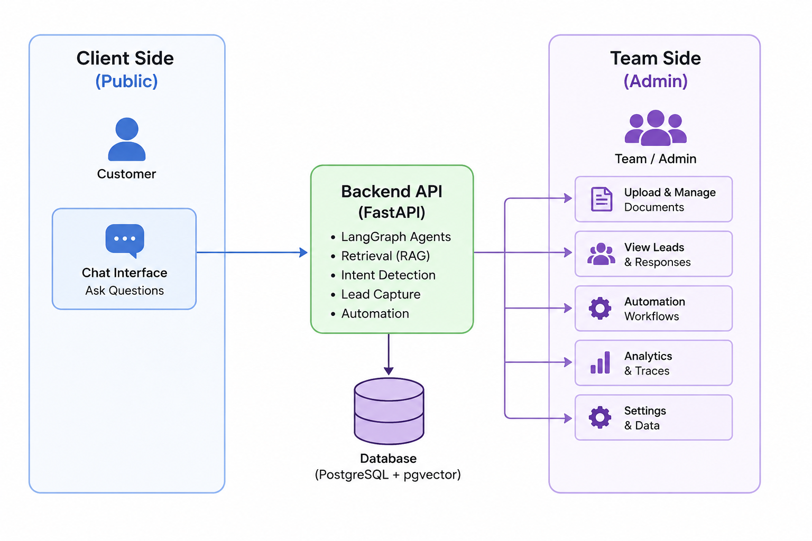

# Smart AI Business Assistant Platform 🚀

[](https://fastapi.tiangolo.com/)
[](https://reactjs.org/)
[](https://www.docker.com/)
[](https://www.postgresql.org/)

A production-ready, highly modular AI business assistant designed for SMEs. Features include conversational lead capture, dynamic knowledge retrieval (RAG) using vector databases, and multi-agent business workflows managed by LangGraph.

---

## 🌟 Key Features

1. **Conversational Lead Capture**
   - Seamlessly extracts intent, contact details, and requirements via natural language conversation.
2. **Knowledge Base & RAG Integration**
   - Upload `.txt`, `.md`, or PDF files to automatically chunk and embed data into a local vector store (ChromaDB) or PGVector.
   - Grounded LLM responses based strictly on provided enterprise data.
3. **Multi-Agent Workflows**
   - Orchestrated via LangGraph, enabling agents to handle data synchronization, email triggers, and context summarization based on state machines.
4. **Enterprise Dashboard**
   - Secure, JWT-protected admin views for managing Leads, Chat configurations, Analytics (Recharts), and Agent Workflows.

---

## 🏗️ Architecture & Tech Stack

The application is split into a separated Frontend and Backend, orchestrated via Docker. This ensures a strict boundary between public client interactions and secure administrative operations.

### High-Level System Flow


### Client vs. Admin Separation


### Backend
- **Framework**: FastAPI (Python 3.12)
- **AI/LLM orchestration**: LangGraph & LangChain
... (keep the rest of your list)
## 🏗️ Architecture & Tech Stack

The application is split into a separated Frontend and Backend, orchestrated via Docker.

### Backend
- **Framework**: FastAPI (Python 3.12)
- **AI/LLM orchestration**: LangGraph & LangChain
- **Models**: Google Gemini (Primary), Groq Llama 3 (Fallback)
- **Database**: PostgreSQL (via SQLAlchemy / Neon)
- **Vector Store**: PGVector / Local ChromaDB

### Frontend
- **Framework**: React.js with Vite
- **Styling**: Tailwind CSS & Framer Motion for enterprise-grade UI animations
- **Data Visualization**: Recharts
- **State Management**: React Context & local storage

---

## 🚀 Deployment & Installation

The project is fully Dockerized for both development and production environments. Alternatively, it can be deployed **100% for free** using cloud services without managing Docker.

### Prerequisites
- [Docker](https://docs.docker.com/get-docker/) & [Docker Compose](https://docs.docker.com/compose/install/) (For local/Docker deployment)
- Node.js & Python (If running locally without Docker)

### 1. Environment Setup

Copy the example environment file and configure your secrets:

```bash
cp .env.example .env
```

**Required Configuration in `.env`:**
```ini
# Database (Auto-configured if using the internal Docker DB, else use a managed service like Neon)
DATABASE_URL=postgresql+psycopg://admin:password123@db:5432/smartai

# AI Providers
GEMINI_API_KEY=your_gemini_key_here
GROQ_API_KEY=your_groq_key_here

# Security
JWT_SECRET_KEY=generate_a_secure_random_string_here
```

### 2. Development Environment (Hot Reloading)

For active development, run the standard compose file. This mounts local volumes and exposes Vite's hot-reload server.

```bash
docker-compose up --build
```
- **Frontend Dashboard**: [http://localhost:5173](http://localhost:5173)
- **Backend API Docs**: [http://localhost:8000/docs](http://localhost:8000/docs)

### 3. Production Deployment (100% Free Cloud Strategy) 🌐

If you don't want to manage servers or pay for Docker hosting, you can deploy this entire stack **for free** using the following architecture:

**1. Database: [Neon Serverless Postgres](https://neon.tech/)**
- Provides a free tier PostgreSQL database. 
- Get your connection string and set it as `DATABASE_URL`.

**2. Backend API: [Render](https://render.com/) (Web Service)**
- Connect your GitHub repository to Render.
- Create a new "Web Service" pointing to the `backend/` directory.
- Build Command: `pip install -r requirements.txt`
- Start Command: `uvicorn app.main:app --host 0.0.0.0 --port $PORT`
- Add your Environment Variables (`DATABASE_URL`, `GEMINI_API_KEY`, etc.).
- *Note: The free tier will spin down after 15 minutes of inactivity and take ~50 seconds to wake up.*

**3. Frontend: [Vercel](https://vercel.com/) or [Render Static Site]**
- Connect your GitHub repository.
- Root Directory: `frontend/`
- Build Command: `npm run build`
- Output Directory: `dist`
- Set `VITE_API_URL` to your new Render Backend URL (e.g., `https://my-backend.onrender.com/api/v1`).
- Deploys instantly with a free SSL certificate and global CDN.

### 4. Docker Production Deployment (Alternative)
If you prefer a self-hosted VPS (e.g., DigitalOcean Droplet, AWS EC2):
```bash
docker-compose -f docker-compose.prod.yml up -d --build
```
- The frontend is served via an optimized Nginx container on port `80`.
- Data persistence is handled via Docker volumes (`pgdata_prod`).

---

## 📂 Project Structure

```text
smart-ai-business-assistant/
├── backend/
│   ├── app/                # FastAPI application logic
│   │   ├── api/            # API Route endpoints
│   │   ├── core/           # Security, config, JWT logic
│   │   ├── models/         # SQLAlchemy DB models
│   │   └── services/       # LangGraph agents & AI orchestration
│   ├── Dockerfile          # Backend container definition
│   └── requirements.txt    # Python dependencies
├── frontend/
│   ├── src/                # React application logic
│   │   ├── components/     # Reusable UI elements
│   │   └── pages/          # Admin dashboard views
│   ├── Dockerfile          # Vite Dev Dockerfile
│   └── Dockerfile.prod     # Nginx Prod Dockerfile
├── docker-compose.yml      # Dev Orchestration
├── docker-compose.prod.yml # Prod Orchestration
└── README.md
```

---

## 🔒 Security & Best Practices

- **Never commit `.env` files.** They are ignored in `.gitignore`.
- Change your `JWT_SECRET_KEY`, `POSTGRES_USER`, and `POSTGRES_PASSWORD` before a production deployment.
- It is highly recommended to place an API Gateway or Reverse Proxy (like Traefik or an external Nginx instance) in front of the application in production to handle HTTPS (SSL/TLS) termination.

---

## 📝 License
Proprietary & Confidential. Internal use only.
